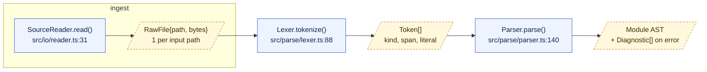

# Mermaid Conventions (v11+, verified 2026-08)

Source: https://mermaid.js.org/syntax/flowchart.html, /syntax/architecture.html

## 1. Diagram type selection

| Need | Use |
|---|---|
| System overview, module map, layering | `flowchart TD` (layers) or `flowchart LR` (pipelines), `subgraph` per layer/package |
| Data flow with payloads (the atlas default) | `flowchart LR` + payload nodes (§3) |
| Request/response over time, ordering, async | `sequenceDiagram` |
| Cloud/infra deployment topology (services, DBs, queues) | `architecture-beta` (v11.1+, still 🔥 beta — layout heuristics overlap nodes; needs `align` in v11.16+) |
| Stakeholder-facing context/container view | C4 (`C4Context`/`C4Container`) — also experimental; prefer flowchart+subgraph unless C4 is explicitly requested |

Default to `flowchart`. It is the only fully stable, richly styleable type. Use `architecture-beta`/C4 only when the audience expects that notation.

`architecture-beta` shape reminder:
```
architecture-beta
    group api(cloud)[Public API]
    service db(database)[Database] in api
    service srv(server)[Server] in api
    db:R --> L:srv
```

## 2. Syntax essentials + gotchas

- **Node ids**: alphanumeric + `_`. Never `end` (lowercase) — breaks the parser; never start an id with `o`/`x` adjacent to an edge (`A---oB` becomes a circle-edge). Ids are case-sensitive and become the label if no label given.
- **Labels with special chars**: always quote — `A["Handler (v2): parse & emit"]`. Escape reserved glyphs with entity codes: `#35;` = `#`, `#quot;` = `"`. Parens, colons, slashes, and `-` are safe *inside* quotes.
- **Line breaks**: `<br/>` inside quoted labels. Backtick markdown strings (``A["`**bold**`"]``) auto-wrap and honor real newlines.
- **File:line labels**: put them on their own line — `A["AuthMiddleware<br/>src/auth/mw.ts:42"]`. Colons are fine inside quotes.
- **Shapes**: `[rect]`, `(round)`, `([stadium])`, `[[subroutine]]`, `[(cylinder/db)]`, `((circle))`, `{rhombus}`, `{{hexagon}}`, `[/parallelogram/]`. v11 adds `A@{ shape: doc }` for 30+ named shapes.
- **Edges**: `A --> B`, labeled `A -->|"parsed AST"| B`, dashed `A -.-> B`, thick `A ==> B`.
- **Subgraphs**: `subgraph pkg_auth ["auth package"] … end`; set `direction LR` on the first line inside. Gotcha: an explicit subgraph `direction` is ignored when an edge crosses the subgraph boundary — Mermaid falls back to the parent direction.
- **Styling**: `classDef` only; external CSS is overridden by Mermaid's inline styles. Assign with `class A,B name;` or inline `A:::name`.

## 3. THE PAYLOAD-NODE CONVENTION (required for data-flow diagrams)

Rule: **every component node is immediately followed downstream by exactly one payload node describing what it emits.** Edges never go component→component directly; they go `COMP --> COMP_out --> NEXT`.

- Payload node id: `<component_id>_out` (multiple outputs: `_out_ok`, `_out_err`).
- Payload node shape: parallelogram `[/"..."/]` (input/output glyph). Fall back to a plain rect if the label contains `/`.
- Payload label: shape of the data, not prose. `[/"Token[] (lexemes)<br/>~1 per source line"/]`.
- Component label carries `name<br/>path:line`.
- Style block (valid Mermaid, dashed gold-on-cream):

```
classDef payload fill:#fff8dc,stroke:#b8860b,stroke-width:1px,stroke-dasharray: 4 3,color:#3b2f00
classDef comp fill:#eef4ff,stroke:#3b5bdb,stroke-width:1px,color:#10204d
```

Full example:



## 4. Validation at runtime (pick first available)

1. `mcp__claude_ai_Mermaid_Chart__validate_and_render_mermaid_diagram` — preferred; parses and renders, returns syntax errors. Zero disk cost.
2. `mcp__codemunch__render_diagram` / `mcp__codemunch-adagio__render_diagram` — renders atlas diagrams in-repo.
3. `npx -y @mermaid-js/mermaid-cli mmdc -i d.mmd -o d.svg` — **last resort**. Downloads Chromium/Puppeteer (hundreds of MB). Forbidden on disk-constrained hosts (e.g. largo). Check `df -h "$HOME"` first; if <5 GB free, do not run it.
4. No validator available → structural lint by hand: balanced `subgraph`/`end`, every quoted label closed, no bare `end` ids, every `class` target defined, every `classDef` name referenced.

Never ship an unvalidated diagram silently — state which method verified it, or state that none was available.

## 5. Runtime probe before hand-rolling

Before writing diagrams, the consuming agent must probe its own environment:

1. List loaded + deferred tools; grep names for `mermaid|diagram|render|chart` (with ToolSearch: `ToolSearch "mermaid diagram render"`, then `select:<exact names>`).
2. List available skills for `mermaid|diagram|dataviz|artifact-diagramming`; load one if it exists rather than inventing conventions.
3. Check the repo for existing `.mmd`/```mermaid blocks (`rg -l 'mermaid|```mermaid'`) and match their established style, ids, and classDefs.
4. Only if all three come up empty, hand-roll using this document.
