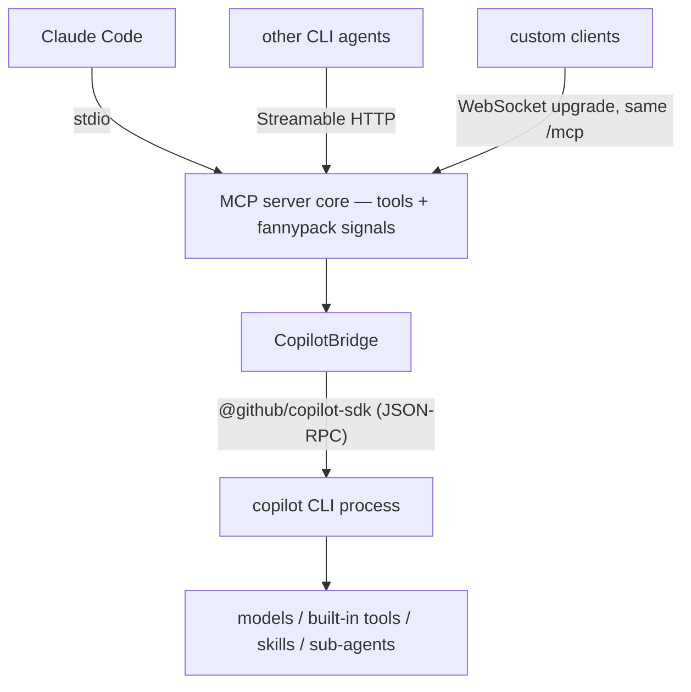

# copilot-mcp

The **full GitHub Copilot CLI agentic process wrapped as an MCP server**, so other CLI agents (Claude Code, Codex, Cursor, even copilot itself) can query Copilot through the Model Context Protocol.

- Wraps the real agentic `copilot` CLI via the official **`@github/copilot-sdk`** (JSON-RPC to a CLI child process the SDK spawns, or attach to an external `copilot --headless --port N` via `COPILOT_MCP_CLI_URL`). Not the deprecated one-shot `gh copilot` extension.
- **Three transports**: stdio, Streamable HTTP, and WebSocket (SEP-1287 semantics: WS upgrade on the same `/mcp` endpoint, one JSON-RPC message per frame).
- Built on the **MCP TypeScript SDK v2** (`@modelcontextprotocol/server` 2.0.0): serves the **2026-07-28** spec revision and legacy **2025-11-25** from one endpoint.
- Ships standalone **JSON-RPC 2.0 typings + helper classes** ([src/jsonrpc/](src/jsonrpc/)) and consumes the [`@agent-fannypack/mcp`](../agent-fannypack/mcp/) signal primitives.

## Tools

| Tool | Purpose |
|---|---|
| `ask` | **The headline tool.** Prompt → completed Copilot turn (idle-signal semantics, timeout-guarded). `session_id` continues a conversation. |
| `session_create` / `session_list` / `session_destroy` | Persistent multi-turn session lifecycle |
| `session_events` | Recent sanitized lifecycle/tool events (reasoning withheld, verbose tool output dropped) |
| `models_list` | Models available to the wrapped CLI |
| `status` | CLI process state, auth, connection mode, permission policy |
| `ping` | Transport liveness (pongs regardless of agent status) — from @agent-fannypack/mcp |
| `marco` | Agent liveness: routed through a real Copilot session, replies `polo` — from @agent-fannypack/mcp |
| `blast_timer_start` / `check_in` / `blast_timer_status` | Dead-man watchdog; **every action tool call doubles as a check-in**; countdown at zero blows the connection up to nothing — from @agent-fannypack/mcp |

## Config (SSoT: `.env`)

Copy [.env.example](.env.example) → `.env`. Keys: `COPILOT_MCP_HOST` (127.0.0.1), `COPILOT_MCP_HTTP_PORT` (27443, carries both Streamable HTTP and the WS upgrade), `COPILOT_MCP_PERMISSIONS` (`readonly` default: Copilot may read/search, write/shell rejected; `approve-all` opt-in), `COPILOT_MCP_MODEL`, `COPILOT_MCP_CLI_URL`, `COPILOT_MCP_ASK_TIMEOUT_MS`.

## Run

```bash
pnpm check          # typecheck + unit tests + build
pnpm start:stdio    # stdio entry (what MCP clients spawn)
pnpm start:http     # Streamable HTTP + WS on one loopback port
```

Register in Claude Code (user scope):

```bash
claude mcp add copilot-mcp --scope user -- node <abs-path>/copilot-mcp/dist/transports/stdio.js
```

## Live-fire verification

`src/test-client.ts` is a real MCP client (CLI: `-t/--transport stdio|http|ws|all`, `-a/--ask`, `-s/--signals`, `-b/--blast`, `-h/--help`):

```bash
pnpm live-fire -t all -a -s -b
```

Verified 2026-08-05 on this machine, all against the live Copilot process:

- **stdio / HTTP / WS**: tools/list (12 tools), `ping` → pong, `ask("What is 2+2?")` → `"4"` (~7s), `marco` → `"polo"` through a real Copilot session (7–12s RTT), blast timer arm → check-in reset → status.
- **Detonation**: with the watchdog armed and no check-ins, the HTTP server tore down all WS clients, destroyed every session, stopped the CLI child, and exited non-zero at countdown zero.
- **Cross-agent**: `claude -p "…" --allowedTools "mcp__copilot-mcp__ask"` → wrapped Copilot answered through the chain Claude Code → MCP → copilot-mcp → Copilot SDK → CLI process.

## Architecture



State lives in the shared `CopilotBridge` (one CLI process, session registry with bounded 500-event ring buffers) and one shared `BlastTimer` per process — so the stateless per-request HTTP handlers behave identically to the long-lived stdio/WS connections.

## Production hardening (out of scope, documented)

Loopback-only by default; add TLS/auth before non-loopback exposure (`connectionToken` on `--headless`, bearer middleware on HTTP/WS). The Copilot SDK is public preview — versions are pinned; event consumers tolerate unknown event types.
