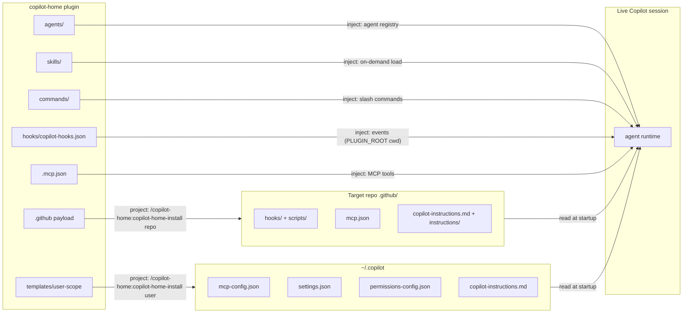

# copilot-home: Injection and Projection

How this plugin gets its content into a Copilot CLI session. Two distinct mechanisms, deliberately separated. Current to Copilot CLI **1.0.78** (2026-08-03); primary sources: docs.github.com CLI plugin/hooks/custom-agents/skills references, github/copilot-cli issue tracker.

## The dividing line

**Injection** is runtime: the plugin participates in the live session — hooks fire, skills load on demand, commands execute, MCP tools answer. Injected surfaces can *act* (and one of them can *block*).

**Projection** is static: files copied into a location the CLI reads unconditionally — `.github/` in a repo, `~/.copilot` for a user. Projected surfaces *instruct*; they are always-on prose the model sees, with no runtime behavior of their own.

A useful test: if removing the plugin mid-session would change behavior, the surface was injected. If the behavior persists because files were written somewhere else, it was projected.

## Injection lanes (plugin manifest → runtime)

| Surface | Manifest field | How it enters the session | Can block? |
|---|---|---|---|
| Agents | `agents: "agents/"` | 7 `.agent.md` registered; `/agent <name>` or model-invoked; discovered recursively, so each agent dir carries its fused assets (system-prompt.md, specialized_role.md, mission.md) | no |
| Skills | `skills: "skills/"` | 22 `SKILL.md` loaded on description match or explicit `/skill` reference; progressive disclosure pulls sibling files only when the skill activates | no |
| Commands | `commands: "commands/"` | 22 TOML evokers, namespaced `/copilot-home:<name>`, `{{args}}` interpolated — the user-invoked lane into the same skills | no |
| Hooks | `hooks: "hooks/copilot-hooks.json"` | sessionStart (blackboard init + `additionalContext`), preToolUse (preflight-guard), postToolUse/errorOccurred (blackboard append), sessionEnd | **preToolUse: yes** |
| MCP | `mcpServers: ".mcp.json"` | copilot-mcp server (12 tools) — the transport for the peer council's persistent sessions | no |

### The plugin-hooks caveat (#2540/#3659)

Plugin-declared `preToolUse` historically never fired: the hook's relative script path resolves against the **project cwd**, not the plugin install root. Since 1.0.57 the failure mode flipped from silent no-op to loud deny. This plugin applies the confirmed workaround — `"cwd": "${PLUGIN_ROOT}/hooks"` on every hook entry (`PLUGIN_ROOT` injected since 1.0.26; `cwd` variable expansion since 1.0.60). **`PLUGIN_ROOT` is not officially documented**; that is exactly why enforcement is dual-lane:

- **Inject lane** (this plugin's `hooks/`): best-effort, travels with the plugin.
- **Project lane** (`.github/hooks/` via the installer): the reliable lane, and the *only* lane the cloud agent loads.

Also inherited from CLI semantics: hook **timeouts always fail open**, and a non-zero `preToolUse` exit fails closed. Keep hook scripts fast; treat the repo-scope lane as the backstop.

## Projection lanes (installer → static config)

The plugin manifest cannot express repo-scope hooks, user-scope MCP registration, or user settings. `/copilot-home:copilot-home-install` closes the gap, with diff-preview before every write:

**`repo` target → `<repo>/.github/`**
- `hooks/copilot-home.json` + `hooks/scripts/*` (scripts copied from the plugin's canonical `hooks/scripts/` — one source of truth)
- `mcp.json` (workspace MCP config — auto-loaded by the CLI)
- `copilot-instructions.md` + `instructions/copilot-home.instructions.md` (`applyTo`/`excludeAgent` frontmatter)
- committed to git, so every teammate inherits on pull — projection scales socially in a way injection (per-user plugin install) does not

**`user` target → `~/.copilot` (respects `COPILOT_HOME`)**
- `mcp-config.json` — jq-merged, never overwritten
- `settings.json` — key-by-key confirmed merge
- `permissions-config.json` — proposed `tool_approvals` for the copilot-mcp tools, applied on confirmation
- `copilot-instructions.md` — managed `<!-- copilot-home:begin/end -->` block
- `config.json` — **never touched** (machine-managed; see `templates/user-scope/config.json.annotated.md`)

## Instruction precedence reality

The CLI defines no formal precedence: all applicable instruction files (user `copilot-instructions.md`, repo `.github/copilot-instructions.md`, `AGENTS.md`, path-scoped `*.instructions.md` whose `applyTo` matches) are **combined and deduped**; among nested `AGENTS.md` files the nearest wins. Projection therefore aims for *additive* instructions — the managed block pattern keeps ours removable and non-conflicting.

## Verification protocol (both lanes)

File placement proves nothing. After install or upgrade:
1. Hooks live? Attempt a blocked command (`git push --force` dry-run context) and confirm denial.
2. MCP live? `ping` through copilot-mcp; `marco` for full-path liveness (routes a real Copilot session).
3. Blackboard live? Start a session, confirm `${COPILOT_PLUGIN_DATA}/agent_blackboard/<session_id>.jsonl` exists with a `session_start` entry carrying a well-formed traceparent.
4. Restart note: hooks and MCP config load at CLI startup — restart after any edit.

## Phase 2: OTel

Every blackboard entry already carries W3C `traceparent` (trace_id = md5(session_id), fresh span_id per entry) and per-agent `otel-service-name` metadata lives in each `.agent.md`. Instrumentation is then an exporter concern — tail the JSONL into OTLP without schema changes. The copilot-sdk lane (TelemetryConfig, automatic traceparent propagation) is the native complement; nothing in this plugin's design closes that door.
