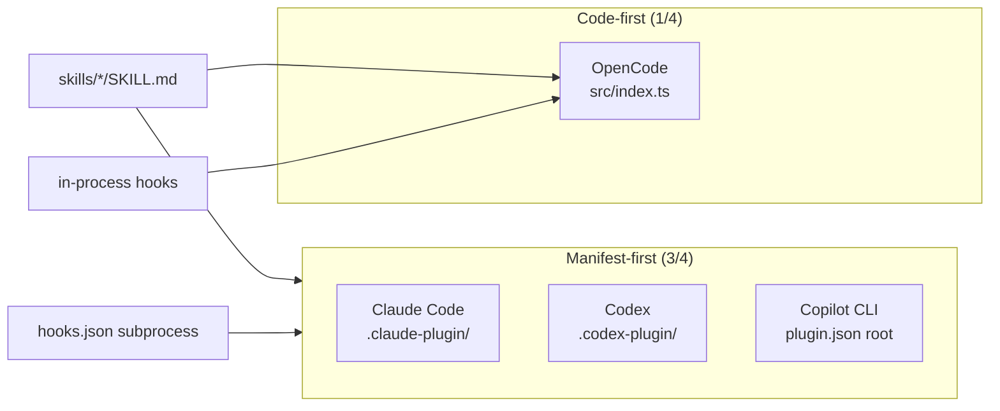

# Kitchen-Sink Plugins — Cross-Platform Compare & Contrast

**Date:** 2026-07-06  
**Scope:** GitHub Copilot CLI, Claude Code, OpenAI Codex CLI, OpenCode  
**Local scaffolds:** `plugins/kitchen-sink-{copilot-cli,claude-code,codex,opencode}/`  
**Hook prototypes:** `prototypes/hooks/*.hooks.jsonc`

---

## 1. Executive summary

All four CLIs support **extending the agent** through installable bundles, but they diverge sharply on **manifest location**, **hook wire protocol**, and **distribution**.

| Dimension | Common ground | Unique to one platform |
|-----------|---------------|------------------------|
| **Skills** | `SKILL.md` + YAML frontmatter (`name`, `description`) | Codex adds `agents/openai.yaml`; OpenCode adds npm skill packages |
| **Agents** | Markdown definitions with frontmatter | Copilot: `*.agent.md`; Claude: `agents/*.md`; OpenCode: `opencode.json` `agent` block |
| **Hooks** | Pre/post tool interception is universal | OpenCode: in-process TS only; Claude: 30 events + 5 handler types |
| **MCP** | `.mcp.json` companion file pattern | Codex: per-plugin MCP policy in user `config.toml` |
| **Distribution** | Marketplace/catalog JSON | Codex personal `~/.agents/plugins/marketplace.json`; Copilot `.github/plugin/marketplace.json` |

**The two truly portable hook moments** (see `prototypes/hooks/hook-overlap-across-agents.md`): `PreToolUse` and `PostToolUse` — subprocess JSON stdin/stdout on Copilot, Claude, and Codex. OpenCode requires a full rewrite as TS functions.

---

## 2. Manifest location & schema

| Platform | Manifest path | Required fields | Notable optional fields |
|----------|---------------|-----------------|-------------------------|
| **Copilot CLI** | `plugin.json` (root, `.github/`, or `.claude-plugin/` compat) | `name`, `description`, `version` | `agents`, `skills`, `hooks`, `mcpServers`, `lspServers` |
| **Claude Code** | `.claude-plugin/plugin.json` | `name` (kebab-case) | `userConfig`, `channels`, `dependencies`, `experimental.themes`, `experimental.monitors` |
| **Codex** | `.codex-plugin/plugin.json` | `name`, `version`, `description`, `author`, `interface.*` | `skills`, `mcpServers`, `apps` — **`hooks` rejected by validator, accepted at runtime** |
| **OpenCode** | *None* — `package.json` + `opencode.json` `plugin[]` | npm module exporting default function | `opencode.json` for agents, commands, skills paths |

---

## 3. Extension points matrix

| Extension | Copilot CLI | Claude Code | Codex | OpenCode |
|-----------|:-----------:|:-----------:|:-----:|:--------:|
| Skills | ✅ `skills/*/SKILL.md` | ✅ | ✅ | ✅ `.opencode/skills/` |
| Agents | ✅ `*.agent.md` | ✅ `agents/*.md` | ❌ manifest | ✅ `opencode.json` + `.opencode/agents/` |
| Hooks (subprocess) | ✅ 14 events | ✅ 30 events | ✅ 10 events | ❌ |
| Hooks (in-process) | ❌ | ❌ | ❌ | ✅ full `Hooks` interface |
| Commands / slash | ✅ | ✅ `commands/` (legacy) | ❌ | ✅ `.opencode/commands/` |
| MCP | ✅ `.mcp.json` | ✅ | ✅ | ✅ `opencode.json` `mcp` |
| LSP | ✅ `lsp.json` | ✅ `.lsp.json` | ❌ | ✅ `lsp` in config |
| Apps / connectors | ❌ | ❌ | ✅ `.app.json` | ❌ |
| Themes | ❌ | ✅ `themes/` | ❌ | ✅ `.opencode/themes/` |
| Monitors | ❌ | ✅ `monitors/` | ❌ | ❌ |
| Output styles | ❌ | ✅ `output-styles/` | ❌ | ❌ |
| Custom tools | via MCP | via MCP | via MCP | ✅ `tool` map in plugin |
| Scripts/assets | convention | convention | convention | convention |

---

## 4. Hook system comparison

| Aspect | Copilot CLI | Claude Code | Codex | OpenCode |
|--------|-------------|-------------|-------|----------|
| **Event count** | 14 | 30 | 10 | 20+ TS hook names |
| **Wire protocol** | JSON stdin/stdout subprocess | Same | Same | In-process async functions |
| **Config file** | `hooks.json` or inline settings | `hooks/hooks.json` or inline manifest | `hooks/hooks.json` (default discovery) | `src/index.ts` return object |
| **Blocking** | Exit 2 (varies by event); preToolUse fail-closed | Exit 2; event-specific | Exit 2 + JSON `decision` | `throw new Error()` |
| **Context injection** | `additionalContext` | `hookSpecificOutput.additionalContext` | `additionalContext` | Mutate `output` in place |
| **Compat shim** | Reads Claude `.claude/settings.json`; PascalCase events | Native lingua franca | `CLAUDE_PLUGIN_ROOT` env vars | N/A |
| **Unique events** | `preMcpToolCall`, `errorOccurred` | `WorktreeCreate`, `Elicitation`, `TaskCreated` | `PostCompact` | `shell.env`, `chat.params`, `tool.definition` |

**Handler types:** Claude Code alone supports `command`, `http`, `mcp_tool`, `prompt`, `agent`. Copilot and Codex are **command-only** today (Codex parses but skips `prompt`/`agent`). The `kitchen-sink-claude-code` plugin wires live exemplars for all five handler types.

---

## 5. Config precedence & deployment

```mermaid
flowchart TB
  subgraph copilot["Copilot CLI"]
    CP1["/etc/github-copilot/policy.d"]
    CP2[".github/hooks + .github/copilot/settings.json"]
    CP3["~/.copilot/hooks + settings.json"]
    CP4["plugin hooks.json"]
    CP1 --> CP2 --> CP3 --> CP4
  end
  subgraph claude["Claude Code"]
    CL1["Managed policy"]
    CL2[".claude/settings.json"]
    CL3["~/.claude/settings.json"]
    CL4["plugin hooks"]
    CL1 --> CL2 --> CL3 --> CL4
  end
  subgraph codex["Codex"]
    CX1["Enterprise managed_dir"]
    CX2["~/.codex/hooks.json"]
    CX3["project .codex/hooks.json trusted"]
    CX4["plugin hooks/hooks.json"]
    CX1 --> CX2 --> CX3 --> CX4
  end
  subgraph opencode["OpenCode"]
    OC1["MDM / managed"]
    OC2["~/.config/opencode/opencode.json"]
    OC3["project opencode.json"]
    OC4["plugin TS modules merged in load order"]
    OC1 --> OC2 --> OC3 --> OC4
  end
```

**Merge semantics:**
- **Copilot / Claude:** layered settings; plugin hooks merge when enabled
- **Codex:** **union** — all matching hooks from all layers fire **concurrently** (no ordering)
- **OpenCode:** plugins run **sequentially** in load order, each mutating shared `output`

---

## 6. Marketplace & distribution

| Platform | Catalog file | Default install path | Official scaffold |
|----------|--------------|----------------------|-------------------|
| Copilot CLI | `.github/plugin/marketplace.json` | `copilot plugin install` | ❌ manual |
| Claude Code | `.claude-plugin/marketplace.json` | `claude plugin install` | ✅ `claude plugin init` |
| Codex | `~/.agents/plugins/marketplace.json` or repo `.agents/plugins/` | `codex plugin add name@marketplace` | ✅ `@plugin-creator` skill |
| OpenCode | npm registry or `plugin[]` path | Bun install / local `.ts` | ❌ manual TS |

---

## 7. Hard constraints & gotchas

### Copilot CLI
- Plugin cached on install — **reinstall** after changes
- `preToolUse` fail-closed; timeout fail-open
- Dual naming: camelCase native + PascalCase Claude-compat
- Matcher is **anchored regex** `^(?:PATTERN)$`

### Claude Code
- **Strict JSON** in settings (no JSONC in production)
- Only `plugin.json` inside `.claude-plugin/`
- Plugin agents cannot declare `hooks`, `mcpServers`, `permissionMode`
- `Stop` hook max 8 consecutive blocks
- Mid-session: `/reload-plugins` for hooks/MCP

### Codex
- **Hook trust model** — content-hash approval via `/hooks` TUI
- `validate_plugin.py` **rejects** `hooks` in manifest ([#27141](https://github.com/openai/codex/issues/27141))
- Union hook execution — never assume ordering
- Project hooks require **trusted** project
- 600s default hook timeout

### OpenCode
- **No subprocess hooks** — porting = rewrite as TS
- Plugins share Bun runtime with agent
- `experimental.*` hooks may change without semver notice
- Config merge: later sources override earlier (not union)

---

## 8. Portability guide

| Artifact | Copilot | Claude | Codex | OpenCode |
|----------|:-------:|:------:|:-----:|:--------:|
| `SKILL.md` content | ✅ | ✅ | ✅ | ✅ |
| `PreToolUse` shell script | ✅ | ✅ | ✅ | ❌ rewrite TS |
| `plugin.json` manifest | own schema | own schema | own schema | N/A |
| `hooks.json` events | partial (14) | superset (30) | subset (10) | N/A |
| `.mcp.json` | ✅ | ✅ | ✅ | use `opencode.json` |
| Marketplace entry | separate JSON | separate JSON | separate JSON | npm / config |

**Best portable artifact:** a `PreToolUse`/`PostToolUse` hook script written for Claude Code's stdin/stdout JSON shape, with field-name tweaks for Codex (`tool_name` vs `toolName`) and Copilot (camelCase events).

---

## 9. Recommended reading order (senior dev onboarding)

### Copilot CLI
1. [Creating a plugin](https://docs.github.com/en/copilot/how-tos/copilot-cli/customize-copilot/plugins-creating)
2. [Hooks reference](https://docs.github.com/en/copilot/reference/hooks-reference)
3. Local: `plugins/kitchen-sink-copilot-cli/README.md`

### Claude Code
1. [Plugins reference](https://code.claude.com/docs/en/plugins-reference)
2. [Hooks reference](https://code.claude.com/docs/en/hooks)
3. `anthropics/claude-code/plugins/plugin-dev/` meta-plugin
4. Local: `plugins/kitchen-sink-claude-code/README.md`

### Codex
1. [Build plugins](https://developers.openai.com/codex/plugins/build)
2. [Hooks](https://developers.openai.com/codex/hooks)
3. Local: `skills/.system/plugin-creator/` + `plugins/kitchen-sink-codex/README.md`

### OpenCode
1. [Plugins docs](https://opencode.ai/docs/plugins/)
2. `anomalyco/opencode/packages/plugin/src/index.ts`
3. Local: `plugins/kitchen-sink-opencode/README.md` + `prototypes/hooks/opencode.hooks.jsonc`

---

## 10. Evolution log

| Date | Change | Trigger |
|------|--------|---------|
| 2026-07-06 | Initial document. Scaffolded four `kitchen-sink-*` reference plugins. Synthesized from prototypes/hooks scaffolds, swift-agent reference, Context7 + official docs research. | User request for cross-platform plugin templates |

---

## Sources

- `prototypes/hooks/hook-overlap-across-agents.md`
- `prototypes/hooks/{github-copilot-cli,claude-code,codex,opencode}.hooks.jsonc`
- https://docs.github.com/en/copilot/how-tos/copilot-cli/customize-copilot/plugins-creating
- https://code.claude.com/docs/en/plugins-reference
- https://developers.openai.com/codex/plugins/build
- https://opencode.ai/docs/plugins/
